# Weather App

A beautiful and modern Flutter application to check the weather in cities across Portugal, with support for current location and favorite city preferences.

## Features

- 🌤️ **Current Weather**: View real-time weather for your favorite city or your current location.
- 📍 **Current Location Support**: Option to always show weather for your current location, using device GPS.
- ⭐ **Favorite City**: Select and save your favorite city to see its weather by default.
- 🏙️ **Cities Management**: Add, remove, and search for Portuguese cities.
- 🔄 **Hourly & Weekly Forecast**: See detailed hourly and weekly weather forecasts.
- 🌡️ **Temperature Units**: Switch between Celsius and Fahrenheit.
- ⚡ **Modern UI**: Clean, responsive, and visually appealing interface.
- 💾 **Persistent Preferences**: All user preferences are saved locally (SharedPreferences).

## Screenshots

<p align="center">
  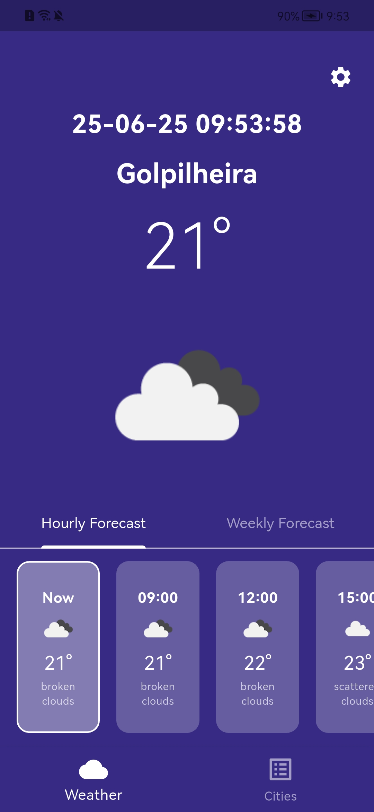
  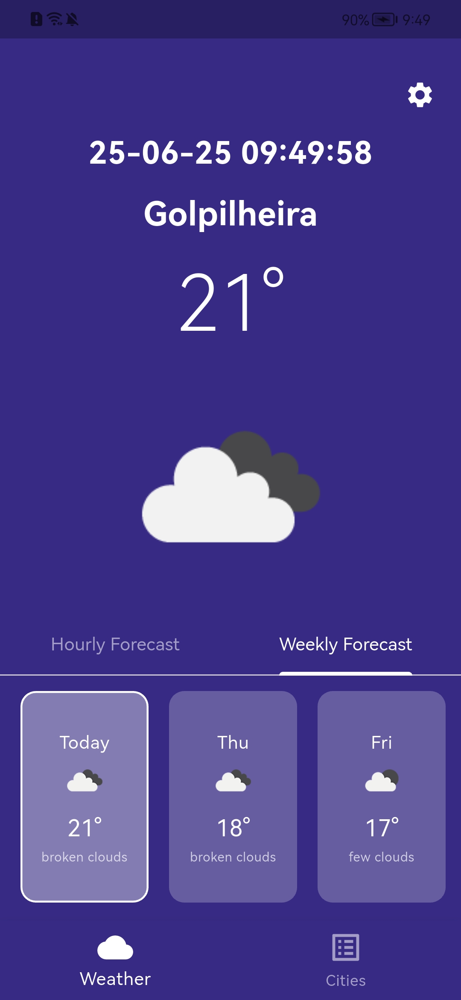
  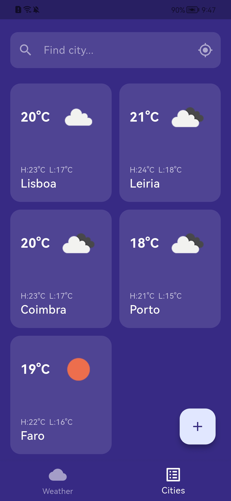
  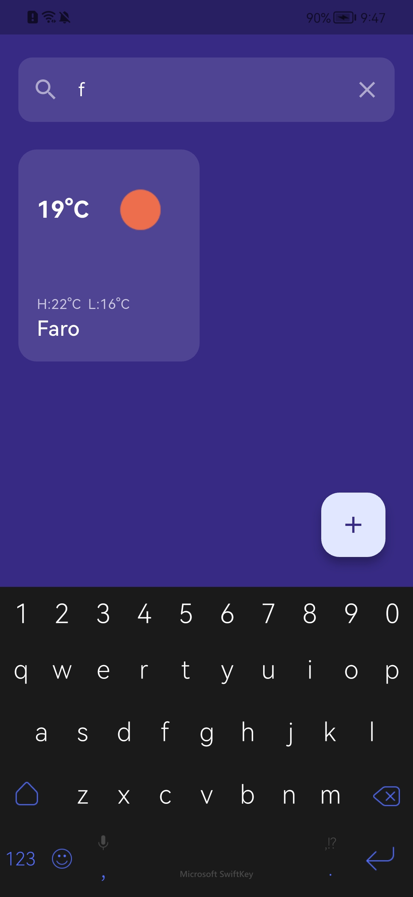
  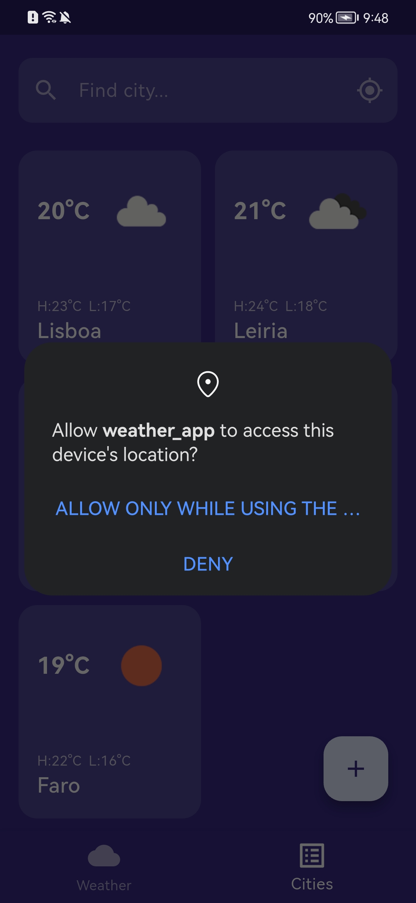
  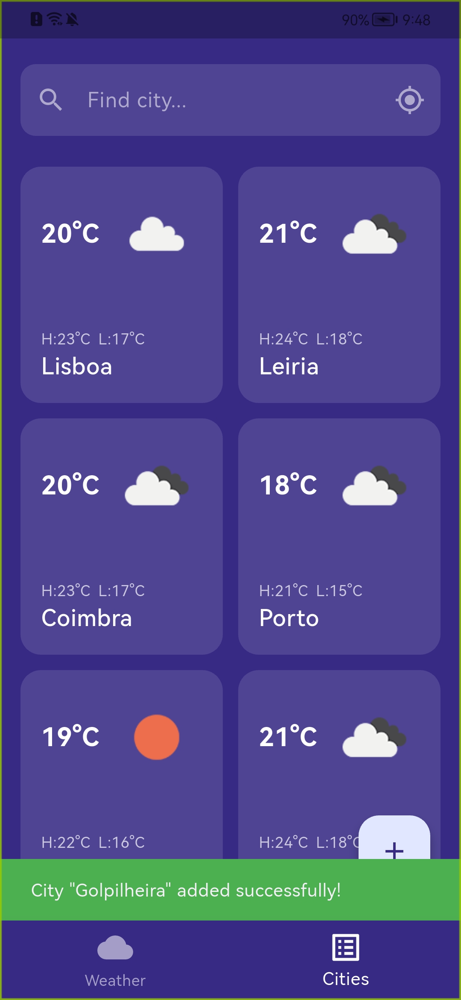
  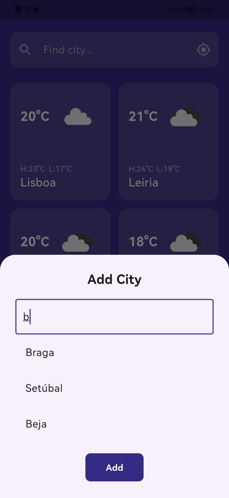
  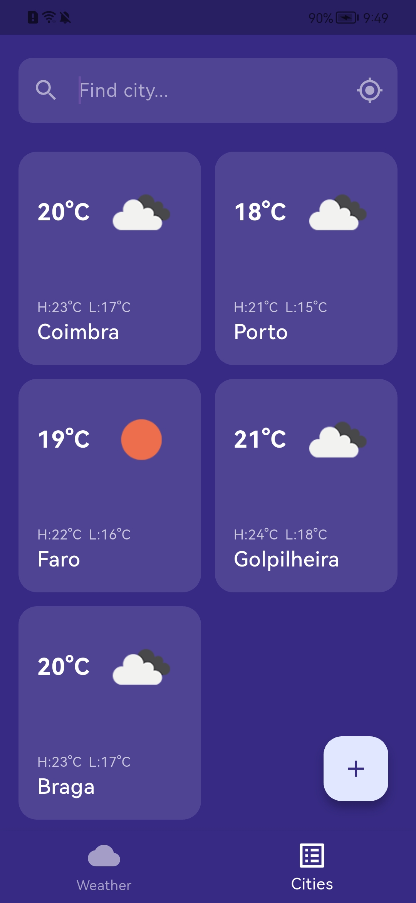
  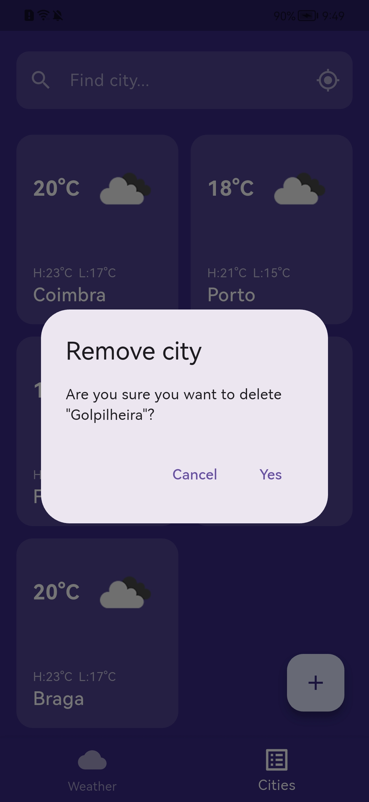
  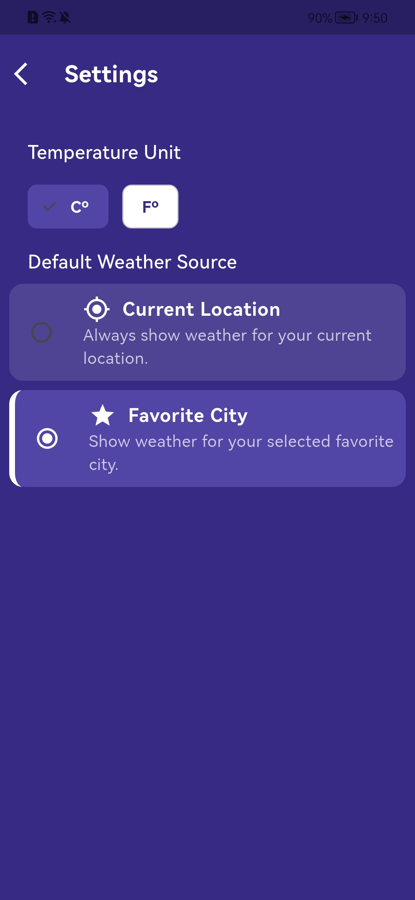
  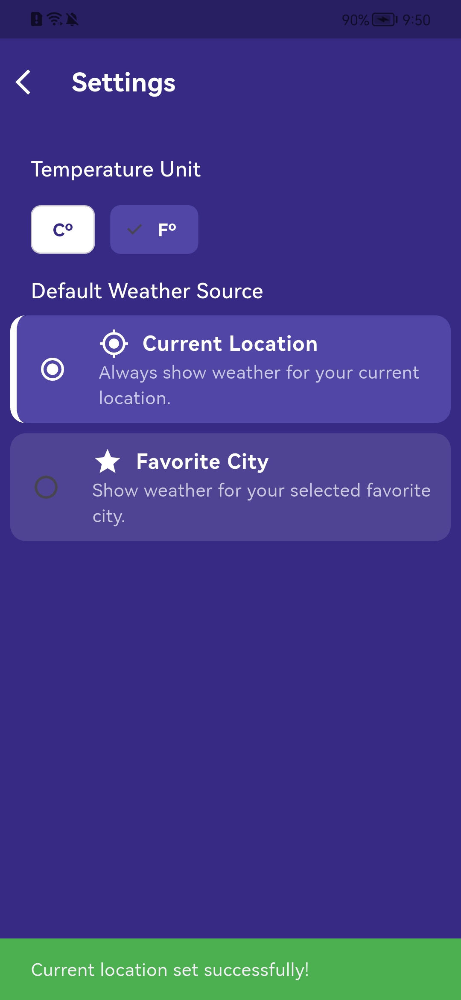
  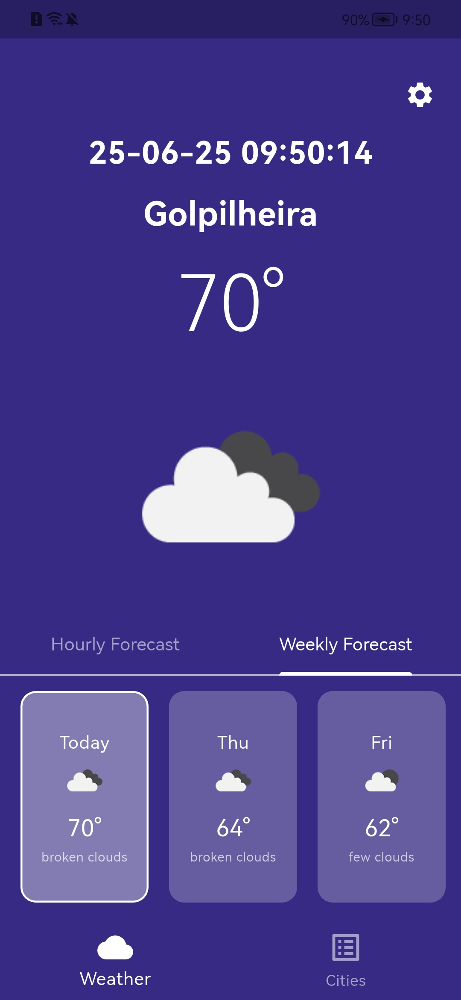
</p>

## Getting Started

### Prerequisites

- [Flutter SDK](https://flutter.dev/docs/get-started/install)
- [Dart SDK](https://dart.dev/get-dart) (usually included with Flutter)
- An API key from [OpenWeatherMap](https://openweathermap.org/api)

### Setup

1. **Clone the repository:**
   ```sh
   git clone <your-repo-url>
   cd weather_app
   ```
2. **Install dependencies:**
   ```sh
   flutter pub get
   ```
3. **Configure environment variables:**
   - Create a `.env` file in the root directory.
   - Add your OpenWeatherMap API key:
     ```env
     WEATHER_API_KEY=your_api_key_here
     ```
4. **Run the app:**
   ```sh
   flutter run
   ```

### Android/iOS Permissions

- The app uses device location. Make sure to accept location permissions when prompted.
- For iOS, ensure you have the correct keys in `Info.plist` for location usage.

## Project Structure

- `lib/`
  - `main.dart` – App entry point
  - `models/` – Data models (City, Weather, etc.)
  - `providers/` – State management (WeatherProvider)
  - `screens/` – UI screens (Weather, Cities, Settings)
  - `services/` – API and data services
  - `utils/` – Utilities (location, preferences, etc.)
  - `widgets/` – Reusable UI components
